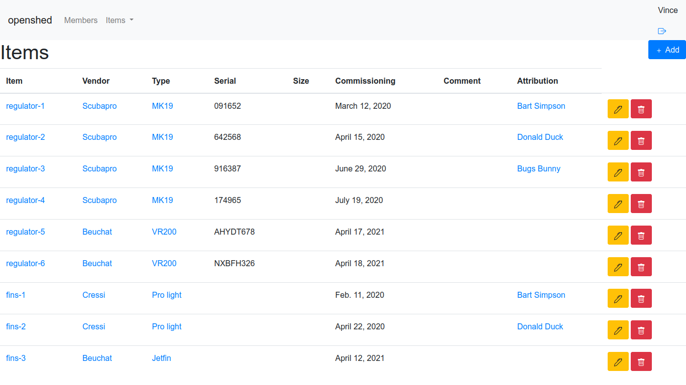
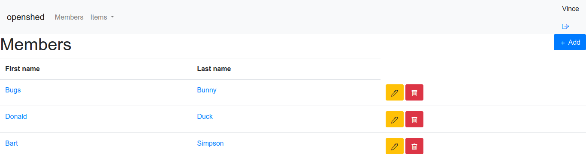
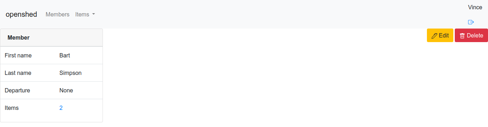
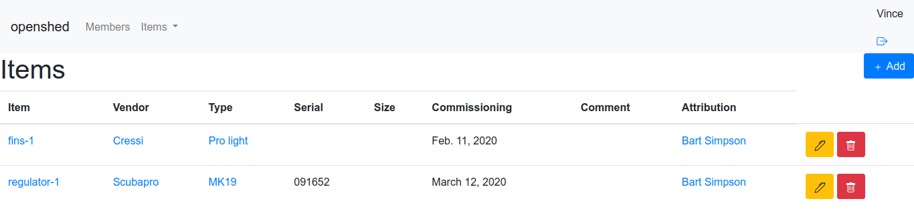

# OpenShed
OpenShed is a Django application to manage inventory. It has been developed to manage equipments for a association but it should be suitable for small business.

Openshed organizes items per types and categories. It keeps trace of who borrows the equipement.

## Installation

### Create a postgres database
`
apt-get install postgresql
su postgres
psql
CREATE DATABASE equipment;
CREATE USER equipment WITH PASSWORD 'secretpass';
ALTER ROLE equipment SET client_encoding TO 'utf8';
ALTER ROLE equipment SET default_transaction_isolation TO 'read committed';
ALTER ROLE equipment SET timezone TO 'UTC';
GRANT ALL PRIVILEGES ON DATABASE equipment TO equipment;
\q
exit
`

### Sensible settings
edit openshed/settings.py
Put a secret key between the quotes in 
`
SECRET_KEY = 'some secret here'
`

Set the permitted host(s)
`
ALLOWED_HOSTS = ['localhost']
`

Connect database
`
DATABASES = {
    'default': {
        'ENGINE': 'django.db.backends.postgresql',
        'NAME': 'equipment',
        'USER': 'equipment',
        'PASSWORD': 'secretpass',
        'HOST': 'localhost',
        'PORT': '5432',
    }
}
`

Set a language and timezone
`
LANGUAGE_CODE = 'en'
TIME_ZONE = 'Europe/London'
`

### Install dependencies
`
apt-get install libpq-dev
`

### Use pipenv to prevent dependency hell
`
pip3 install pipenv
cd /opt/openshed
pipenv install
pipenv update
`

## About OpenShed

With OpenShed you can list all your equipments.

If you want to know all equipments of 1 type, just select the type and then the items.

If you want to know the list of equipment assigned to 1 person just select the member and then the equipments.

# Thanks
Openshed is largely inspired by [NetBox](https://github.com/netbox-community/netbox). I would like to thank them for the amazing work they have done.
